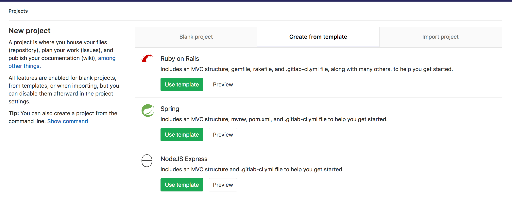
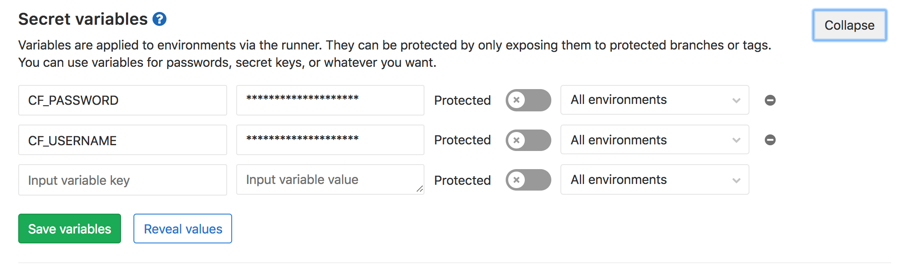

# Deploy a Spring Boot application to Cloud Foundry with GitLab CI/CD

> **Article [Type](../../../development/writing_documentation.html#types-of-technical-articles):** tutorial ||
> **Level:** intermediary ||
> **Author:** [Dylan Griffith](https://gitlab.com/DylanGriffith) ||
> **Publication date:** 2017-11-23

## Introduction

In this article, we'll demonstrate how to deploy a [Spring
Boot](https://projects.spring.io/spring-boot/) application to [Cloud
Foundry (CF)](https://www.cloudfoundry.org/) with GitLab CI/CD using the [Continuous
Deployment](https://about.gitlab.com/2016/08/05/continuous-integration-delivery-and-deployment-with-gitlab/#continuous-deployment)
method.

All the code for this project can be found in this [GitLab
repo](https://gitlab.com/gitlab-examples/spring-gitlab-cf-deploy-demo).

Readers that are interested in deploying Spring Boot applications to Kubernetes
using GitLab CI/CD can read about that in [this blog post by Marco
Lenzo](https://about.gitlab.com/2016/12/14/continuous-delivery-of-a-spring-boot-application-with-gitlab-ci-and-kubernetes/).

## Prerequisites

_We assume you are familiar with Java and Git but would like to learn how to
automate the deployment of Spring Boot Applications to Cloud Foundry using
GitLab CI/CD._

To follow along with this tutorial you will need the following:

- An account on [Pivotal Web Services (PWS)](https://run.pivotal.io/) or any
  other Cloud Foundry instance

NOTE: You will need to replace the `api.run.pivotal.io` URL in the all below
commands with the [API
URL](https://docs.cloudfoundry.org/running/cf-api-endpoint.html) of your CF
instance if you're not deploying to PWS.

## Create Your Project

To create your Spring Boot application you can use the Spring template in
GitLab when creating a new project:



## Configure Your Cloud Foundry Deployment

To deploy to Cloud Foundry we need to add a `manifest.yml` file. This
is the configuration for the CF CLI we will use to deploy the application. We
will create this in the root directory of our project with the following
content:

```yaml
---
applications:
- name: gitlab-hello-world
  random-route: true
  memory: 1G
  path: target/demo-0.0.1-SNAPSHOT.jar
```
## Configure GitLab CI/CD To Deploy Your Application

Now we need to add the the GitLab CI/CD configuration file
([`.gitlab-ci.yml`](../../yaml/README.md)) to our
project's root. This is how GitLab figures out what commands need to be run whenever
code is pushed to our repository. We will add the following `.gitlab-ci.yml`
file to the root directory of the repository, GitLab will detect it
automatically and run the steps defined once we push our code:

```yaml
image: java:8

stages:
  - build
  - deploy

build:
  stage: build
  script: ./mvnw package
  artifacts:
    paths:
      - target/demo-0.0.1-SNAPSHOT.jar

production:
  stage: deploy
  script:
  - curl --location "https://cli.run.pivotal.io/stable?release=linux64-binary&source=github" | tar zx
  - ./cf login -u $CF_USERNAME -p $CF_PASSWORD -a api.run.pivotal.io
  - ./cf push
  only:
  - master
```

We've used the `java:8` [docker
image](../../docker/using_docker_images.md) to build
our application as it provides the up to date Java 8 JDK on [Docker
Hub](https://hub.docker.com/). We've also added the [`only`
clause](../../yaml/README.md#only-and-except-simplified)
to ensure our deployments only happen when we push to the master branch.

Now, since the steps defined in `.gitlab-ci.yml` require credentials to login
to CF, you'll need to add your CF credentials as [environment
variables](../../variables/README.md#predefined-variables-environment-variables)
on GitLab CI/CD. To set the environment variables navigate from your project
using the navigation left sidebar to **Settings > CI/CD** and expand **Secret
Variables**. Name the variables `CF_USERNAME` and `CF_PASSWORD` and set them to
the correct values.



Now when the repo is next pushed we should see the build running on GitLab (under
**CI/CD > Pipelines**) and it should deploy to CF for us.

NOTE: It is considered best practice for security to create a separate deploy
user for your application and add their credentials to GitLab instead of using
a developer's credentials.

To start a deployment now in GitLab go to **CI/CD > Pipelines** then click
on "Run Pipeline".  Once the app is finished deploying it will display the URL
of your application in the logs for the `production` job like:

```
requested state: started
instances: 1/1
usage: 1G x 1 instances
urls: gitlab-hello-world-undissembling-hotchpot.cfapps.io
last uploaded: Mon Nov 6 10:02:25 UTC 2017
stack: cflinuxfs2
buildpack: client-certificate-mapper=1.2.0_RELEASE container-security-provider=1.8.0_RELEASE java-buildpack=v4.5-offline-https://github.com/cloudfoundry/java-buildpack.git#ffeefb9 java-main java-opts jvmkill-agent=1.10.0_RELEASE open-jdk-like-jre=1.8.0_1...

     state     since                    cpu      memory         disk           details
#0   running   2017-11-06 09:03:22 PM   120.4%   291.9M of 1G   137.6M of 1G
```

You can then visit your deployed application (in my case,
https://gitlab-hello-world-undissembling-hotchpot.cfapps.io/) and you should
see the "Spring is here!" message.

## Conclusion

This guide demonstrates the setup necessary to take a Spring Boot application
and deploy it to Cloud Foundry in an automated way using GitLab CI/CD.
